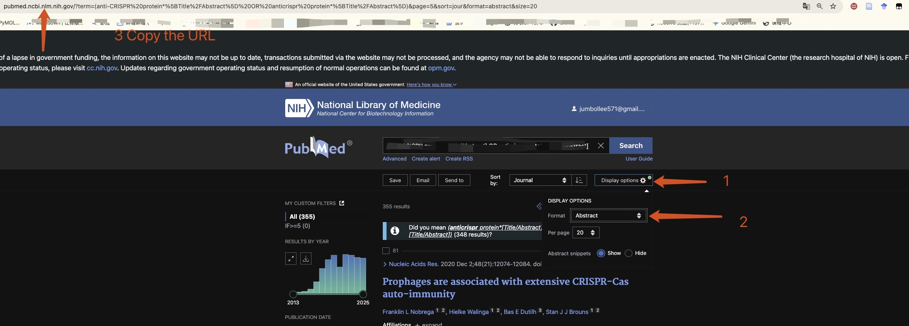

## 一、项目介绍
嗨～这个项目超实用！专门用来爬取 Pubmed 上的检索结果，还能自动把杂乱的结果整理成 **结构化文本**（比如 Excel 表格），后续做文献分析、筛选都超方便，再也不用手动复制粘贴啦～

本项目基于 [pubmed_get](https://github.com/PiaoyangGuohai1/pubmed_get) 修改开发，特别感谢原项目作者的开源贡献！


### 1.1 结构化文本包含的字段
最终输出的表格会涵盖这些关键信息，帮你把文献信息抓得明明白白：
- Title：文献标题
- Journal Abbreviation：期刊缩写（比如「Clin J Am Soc Nephrol」）
- Publication Date：发表日期（格式如「2023-05-15」）
- PMID：Pubmed 唯一标识号（查文献超好用的ID）
- Pubmed Web：文献在 Pubmed 上的直接网页链接
- DOI：文献的 DOI 编号（可直接跳转期刊原文）
- PMC：PMC 编号（若文献在 PMC 库开放，会显示此编号）
- Abstract：文献摘要（全文抓取，不用再点进页面看）
- Citation Counts：引用次数（帮你快速判断文献影响力）
- JournalTitle：期刊完整名称（比如「Clinical Journal of the American Society of Nephrology」）
- category：期刊分类（如 JCR Q1、中科院二区）
- if_2023：2023 年期刊影响因子


### 1.2 结构化文本示例
给大家放个真实的示例表格，一看就知道输出效果啦：

| Title | Journal Abbreviation | Publication Date | PMID | Pubmed Web | DOI | PMC | Abstract | Citation Counts | JournalTitle | category | if_2023 |
|-------|----------------------|------------------|------|------------|-----|-----|----------|----------------|--------------|----------|---------|
| The Gut-Kidney Axis: Mechanisms and Therapeutic Implications | Clin J Am Soc Nephrol | 2023-05-15 | 37172890 | https://pubmed.ncbi.nlm.nih.gov/37172890/ | 10.2215/CJN.08450822 | PMC10183456 | The gut-kidney axis refers to the bidirectional communication between the gastrointestinal tract and the kidneys. Dysregulation of this axis is closely associated with chronic kidney disease (CKD) and gut microbiota dysbiosis... | 42 | Clinical Journal of the American Society of Nephrology | JCR Q1 | 11.0 |


## 二、使用指南（How to use）
操作超简单，小白也能上手！跟着步骤来就行～


### 2.1 先搞定依赖管理：安装并使用 uv
之前用 pip 装依赖又慢又容易出问题？试试 **uv** 吧！它是个超轻量、超快速的 Python 依赖管理工具，强烈推荐～

- uv 的官方 GitHub 地址：[astral-sh/uv](https://github.com/astral-sh/uv)（有更多详细用法）
- 安装 uv（不同系统对应命令，复制粘贴就行）：
  - Windows：打开 PowerShell，运行下面这行命令：
    ```powershell
    iwr https://astral.sh/uv/install.ps1 -useb | iex
    ```
  - macOS/Linux：打开终端，运行下面这行命令：
    ```bash
    curl -LsSf https://astral.sh/uv/install.sh | sh
    ```
- 安装完成后，进入项目的 **根目录**，运行以下命令同步项目依赖（第一次用可能要等几秒，后续会很快）：
  ```bash
  uv sync
  source .venv/bin/activate 
  ```


  ### 2.2 核心操作：爬取 Pubmed 数据
就一行命令的事儿！先记好步骤：

1. 先进入项目里的 `script` 文件夹（所有脚本都在这儿）：
   ```bash
   cd ./script
   ```

2. 运行爬取命令：
   ```bash
   python main.py -u $url -o 你的项目名
   ```

   - 解释一下：
     - `$url`：必须是 Pubmed 搜索后的 **摘要页链接**（不是首页！不是列表页！）
     - `-o 你的项目名`：填你想给这次爬取任务起的名字（比如“肠道肾脏轴_2023-2025”），结果会保存在 `output/你的项目名` 文件夹里


### 2.3 关键：怎么获取 $url（Pubmed 摘要页链接）
很多小伙伴第一次会搞错链接，这里一步一步教你：
1. 打开 Pubmed 官网：https://pubmed.ncbi.nlm.nih.gov/
2. 输入你的检索关键词（比如“gut-kidney axis”“diabetes AND kidney”）
3. 点击搜索后，在结果页右上角找到「Display Options」选项，选择「Abstract」（如下图）
4. 此时浏览器地址栏的链接，就是你要的 `$url`！复制下来就行～
#### 示例图片


### 2.4 可选操作：下载 PMC 文献
如果爬取结果里有 PMC 编号，还能自动下载文献全文：
```bash
cd ./script
python main.py -d "../output/你的项目名/PubMed_xxx.xlsx"
```
- 把 `../output/你的项目名/PubMed_xxx.xlsx` 换成你实际爬取生成的 Excel 路径，文献会自动下载到 Excel 所在的文件夹里～


## 三、更新计划
后续会继续优化功能，目前已经确定的计划是：
- 补充 **2025 年期刊影响因子** 数据（注：该数据仅限中国大陆地区可获取和使用）
- 后续会根据大家的需求，考虑加更多实用功能（比如支持更多分区信息、优化批量翻译速度等），敬请期待！