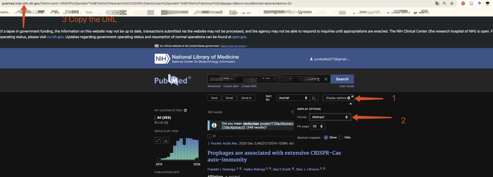

# Pubmed-Crawler

## 一、项目介绍
嗨～这个项目超实用！专门用来爬取 PubMed 上的检索结果，还能自动把杂乱的结果整理成 **结构化文本（Excel）**，并额外生成一个 **卡片式 HTML 阅读视图**，可选开启 **LLM 中文分析**（翻译 / 总结 / 创新点）。后续做文献分析、筛选都超方便，再也不用手动复制粘贴啦～

本项目基于 [pubmed_get](https://github.com/PiaoyangGuohai1/pubmed_get) 修改开发，特别感谢原项目作者的开源贡献！


> 英文版请见 [README](../README.md)。

### 功能亮点
- 🔎 **一行命令爬取** → 结构化 Excel（标题、期刊、日期、PMID、DOI、摘要、引用数、JCR 分区、影响因子…）
- 🤖 **可选 LLM 分析**（`-t`）：自动生成标题/摘要中文翻译、中文总结、创新点
- 🌐 **卡片式 HTML 阅读视图**：搜索、按引用/日期排序、按 JCR 分区筛选、收藏（浏览器本地持久化）、全部/收藏 Tab 切换、一键导出收藏 CSV
- 📥 **批量下载 PDF**（Sci-Hub / PMC）

### 1.1 结构化文本包含的字段
最终输出的表格会涵盖这些关键信息：
- **Title**：文献标题
- **Journal Abbreviation**：期刊缩写（如「Clin J Am Soc Nephrol」）
- **JournalTitle**：期刊完整名称
- **Publication Date**：发表日期（格式如「2023-05-15」）
- **PMID / DOI / PMC**：Pubmed 唯一号、DOI、PMC 编号（若有）
- **Pubmed Web**：文献在 PubMed 的直接链接
- **Abstract**：文献摘要（全文抓取）
- **Citation Counts**：引用次数
- **category**：JCR 分区（如 Q1、Q2）
- **if_2024**：2024 年期刊影响因子（需有 JCR 数据时填充）
- *（仅在使用 `-t` 时生成）* **标题翻译 / 摘要翻译 / 中文总结 / 创新点**：LLM 生成的中文翻译、总结与创新点

### 1.2 结构化文本示例
| Title | Journal Abbreviation | Publication Date | PMID | DOI | PMC | Abstract | Citation Counts | JournalTitle | category | if_2024 |
|-------|----------------------|------------------|------|-----|-----|----------|----------------|--------------|----------|---------|
| The Gut-Kidney Axis: Mechanisms and Therapeutic Implications | Clin J Am Soc Nephrol | 2023-05-15 | 37172890 | 10.2215/CJN.08450822 | PMC10183456 | The gut-kidney axis refers to the bidirectional communication between the gastrointestinal tract and the kidneys... | 42 | Clinical Journal of the American Society of Nephrology | Q1 | 11.0 |


## 二、使用指南

### 2.1 先搞定依赖管理：安装并使用 uv
**uv** 是个超轻量、超快速的 Python 依赖管理工具，强烈推荐～

- 官方仓库：[astral-sh/uv](https://github.com/astral-sh/uv)
- 安装 uv（不同系统对应命令）：
  - Windows（PowerShell）：
    ```powershell
    iwr https://astral.sh/uv/install.ps1 -useb | iex
    ```
  - macOS / Linux：
    ```bash
    curl -LsSf https://astral.sh/uv/install.sh | sh
    ```
- 进入项目**根目录**，同步依赖：
  ```bash
  uv sync
  source .venv/bin/activate   # Windows: .venv\Scripts\activate
  ```

### 2.2 核心操作：爬取 PubMed 数据
1. 先进入 `script` 文件夹：
   ```bash
   cd ./script
   ```
2. 运行爬取命令：
   ```bash
   python main.py -u "$url" -o 你的项目名
   ```
   - `$url`：必须是 PubMed 搜索后的**摘要页链接**（不是首页！不是列表页！）
   - `-o 你的项目名`：给这次任务起个名字（如 `gut_kidney_axis`），结果保存在 `output/你的项目名/`
   - 产出：`PubMed_<关键词>.xlsx`，外加同名的卡片式 `PubMed_<关键词>.html`

### 2.3 可选：LLM 分析（`-t`）
为每篇文献生成中文翻译 / 总结 / 创新点。

1. 复制示例配置并填入你的密钥（`.env` 已被 gitignore，不会入库）：
   ```bash
   cp .env.example .env
   ```
   `.env` 支持任意 **OpenAI 兼容** 接口，默认配置指向阿里云 DashScope 的 `deepseek-v3.2`：
   ```env
   BASE_URL=https://dashscope.aliyuncs.com/compatible-mode/v1
   API_KEY=your-api-key-here
   MODEL=deepseek-v3.2
   ```
2. 加 `-t` 运行：
   ```bash
   python main.py -u "$url" -o 你的项目名 -t
   ```
   新增的四列（标题翻译 / 摘要翻译 / 中文总结 / 创新点）会同时写入 Excel 与 HTML。

### 2.4 HTML 阅读视图
Excel 旁生成的 `.html` 是一个独立可用的阅读视图，浏览器打开即可：
- 🔍 搜索标题（中英文）
- ↕️ 按引用次数 / 发表日期排序
- ▦ 按 JCR 分区筛选
- ☆ 收藏文献（保存在浏览器 localStorage，按 PMID/DOI 标识）
- 在 **全部 / 收藏** Tab 之间切换
- ⬇ 一键导出收藏为 CSV（UTF-8 带 BOM，Excel 友好）

### 2.5 可选：下载 PDF
爬取的同时批量下载全文：
```bash
python main.py -u "$url" \
  -o 你的项目名 \
  --download_dir ./download/你的主题 \
  --error_download_paper failed_downloads.txt
```
下载失败的 PMID 会记录到 `failed_downloads.txt`，方便重试。

### 2.6 关键：怎么获取 `$url`（PubMed 摘要页链接）
1. 打开 PubMed 官网：https://pubmed.ncbi.nlm.nih.gov/
2. 输入检索关键词（如「gut-kidney axis」「diabetes AND kidney」）
3. 搜索后，在结果页右上角找到「Display Options」，选择「Abstract」
4. 此时浏览器地址栏的链接就是你的 `$url`，复制下来即可～




## 三、命令参数一览
| 参数 | 说明 |
|------|------|
| `-u, --url` | PubMed 摘要页链接（必填） |
| `-o, --output` | `output/` 下的输出目录名 |
| `--output-folder` | 输出目录名的另一种写法 |
| `-n, --name` | 自定义 Excel/HTML 文件名 |
| `-t, --translate` | 开启 LLM 分析（需配置 `.env`） |
| `--download_dir` | PDF 保存目录 |
| `--error_download_paper` | 记录下载失败 PMID 的文件路径 |
| `-d, --download` | 旧版下载参数（兼容保留） |


## 四、更新计划
- ✅ 2024 年期刊影响因子与 JCR 分区
- ✅ PMC / Sci-Hub PDF 下载
- ✅ LLM 分析（翻译 / 总结 / 创新点）
- ✅ 卡片式 HTML 阅读视图（收藏、Tab、CSV 导出、分区筛选）
- 🔜 更多分区信息（如中科院分区）、批量 LLM 加速、增量更新等
